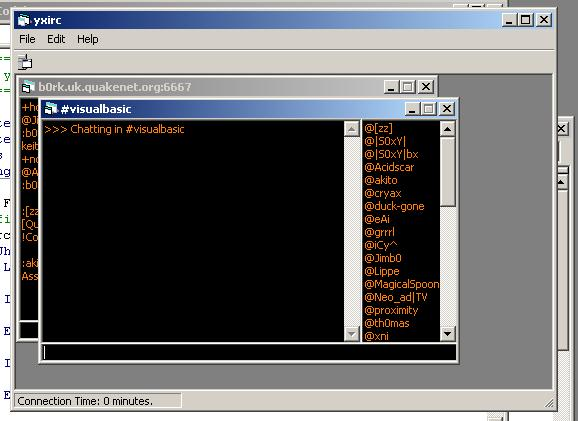



## yx irc client

### Description

This is an irc client using the winsock control, which shows how to parse IRC data, as well as showing how to implement multiple forms for each channel. The coding is as simple as possible and is almost fully commented. :)
 
### More Info
 
make sure that the configuration file is in the same directory as the project (but it should be by default anyway)

             |
---                |---
**Submitted On**   |2003-02-08 16:44:02
**By**             |[James Wykes](https://github.com/Planet-Source-Code/PSCIndex/blob/master/ByAuthor/james-wykes.md)
**Level**          |Intermediate
**User Rating**    |4.5 (18 globes from 4 users)
**Compatibility**  |VB 4\.0 \(32\-bit\), VB 5\.0, VB 6\.0
**Category**       |[Internet/ HTML](https://github.com/Planet-Source-Code/PSCIndex/blob/master/ByCategory/internet-html__1-34.md)
**World**          |[Visual Basic](https://github.com/Planet-Source-Code/PSCIndex/blob/master/ByWorld/visual-basic.md)
**Archive File**   |[yx\_irc\_cli154176292003\.zip](https://github.com/Planet-Source-Code/james-wykes-yx-irc-client__1-43093/archive/master.zip)

